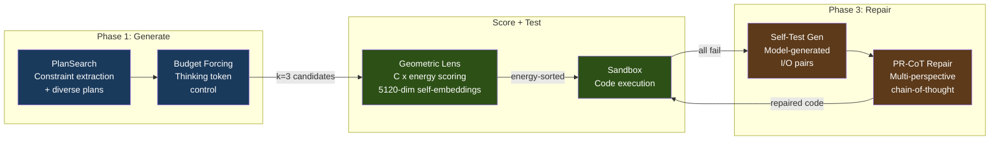

# A.T.L.A.S

**Adaptive Test-time Learning and Autonomous Specialization**

A.T.L.A.S achieves **74.6% LiveCodeBench pass@1** with a frozen 14B model on a single consumer GPU -- up from 36-41% in V2 -- through constraint-driven generation and self-verified iterative refinement. No fine-tuning, no API calls, no cloud -- just a $500 GPU and smart inference.

---

## Benchmark Results

> Hardware: RTX 5060 Ti 16GB | Model: Qwen3-14B-Q4_K_M (frozen)

| Benchmark | Score | Tasks | Method |
|-----------|-------|-------|--------|
| **LiveCodeBench v5** | **74.6% pass@1** | 599 | V3 pipeline: PlanSearch + self-verified PR-CoT repair |
| **GPQA Diamond** | **47.0%** | 198 | k=5, multiple-choice knowledge reasoning |
| **SciCode** | **14.7%** (sub-problems) | 341 | k=1, cross-domain scientific coding |

<details>
<summary><b>V3 ablation breakdown</b></summary>

| Condition | Configuration | Pass Rate | Delta |
|-----------|---------------|-----------|-------|
| A | Baseline (no V3) | 54.9% | -- |
| B | +Phase 1 (PlanSearch + BudgetForcing + DivSampling) | 67.3% | +12.4pp |
| C | +Phase 1+2 (Lens routing) | 67.3% | +0.0pp |
| D | +Phase 1+3 (self-verified refinement) | **74.6%** | +7.3pp |

Phase 3 uses self-generated test cases for internal verification -- the model never sees the answer key during repair. PR-CoT rescues 36/42 tasks (85.7% of Phase 3 rescues). Full report: [V3_ABLATION_STUDY.md](docs/V3_ABLATION_STUDY.md)

</details>

---

## How It Works



A single patched llama-server runs on K3s, providing both generation with speculative decoding (~100 tok/s) and 5120-dim self-embeddings for Lens scoring. The **Geometric Lens** C(x) energy field selects the best candidate (87.8% accuracy on mixed-result tasks). Failed tasks enter Phase 3, where the model generates its own test cases and iteratively repairs solutions via PR-CoT -- real tests are used only for final scoring.

Full architecture: **[docs/ARCHITECTURE.md](docs/ARCHITECTURE.md)**

---

## Quick Start

```bash
git clone https://github.com/itigges22/ATLAS.git && cd ATLAS

cp atlas.conf.example atlas.conf    # set MODEL_PATH, DATA_DIR, GPU device
sudo ./scripts/install.sh
./scripts/verify-install.sh

# Run V3 benchmark
python3 benchmark/v3_runner.py
```

See **[docs/SETUP.md](docs/SETUP.md)** for full installation instructions.

---

## Hardware Requirements

| Resource | Minimum | Tested |
|----------|---------|--------|
| GPU VRAM | 16 GB | RTX 5060 Ti 16 GB |
| System RAM | 14 GB | 16 GB |
| Python | 3.10+ | 3.11 |
| OS | RHEL 9 / Ubuntu 24 | RHEL 9 (Proxmox VM) |

---

## Project Structure

```
benchmark/       Benchmark suite (V2 runner, V3 pipeline, datasets)
benchmark/v3/    V3 subsystems (16 modules: PlanSearch, BudgetForcing, PR-CoT, etc.)
rag-api/         Core API: Geometric Lens, confidence router, RAG, cache
llama-server/    Patched llama.cpp server (spec decode + self-embeddings)
manifests/       K3s deployment manifests
scripts/         Installation and management scripts
tests/           Test suite (infrastructure, integration, V3)
docs/            Architecture, setup, configuration, troubleshooting
api-portal/      API key management portal (JWT auth, web UI)
sandbox/         Isolated code execution environment
```

---

## Documentation

| Document | Description |
|----------|-------------|
| **[ARCHITECTURE.md](docs/ARCHITECTURE.md)** | System architecture, component deep-dives, data flows |
| **[V3_ABLATION_STUDY.md](docs/V3_ABLATION_STUDY.md)** | V3 ablation results and phase contribution analysis |
| **[SETUP.md](docs/SETUP.md)** | Installation and deployment guide |
| **[CONFIGURATION.md](docs/CONFIGURATION.md)** | Configuration reference (including all V3 toggles) |
| **[TROUBLESHOOTING.md](docs/TROUBLESHOOTING.md)** | Common issues and solutions |
| **[API.md](docs/API.md)** | API endpoint documentation |

<details>
<summary><b>Historical documentation</b></summary>

| Document | Description |
|----------|-------------|
| **[V2_5_ABLATION_STUDY.md](docs/V2_5_ABLATION_STUDY.md)** | V2.5 Geometric Lens ablation (embedding source discovery) |
| **[V2_TO_V2_5_MIGRATION.md](docs/V2_TO_V2_5_MIGRATION.md)** | V2 to V2.5 two-server sidecar migration and V3 restoration |

</details>

---

## Roadmap

**V3.0** -- Complete (2026-03-05). 74.6% LCB pass@1 on frozen Qwen3-14B. [Full ablation report](docs/V3_ABLATION_STUDY.md).

**V3.1** -- Planned. Model swap to Qwen3.5-9B, Lens Evolution (online C(x) recalibration), Phase 2 redesign. Target: 80-90% LCB pass@1.

---

## License

Licensed under the A.T.L.A.S Source Available License v1.0 -- see [LICENSE](LICENSE).
