# ATLAS Architecture

System architecture for ATLAS V3.0.1. Two-layer design: an outer agent loop handles tool-call orchestration, and an inner V3 pipeline generates diverse code candidates with build verification and energy-based selection.

---

## 1. System Overview

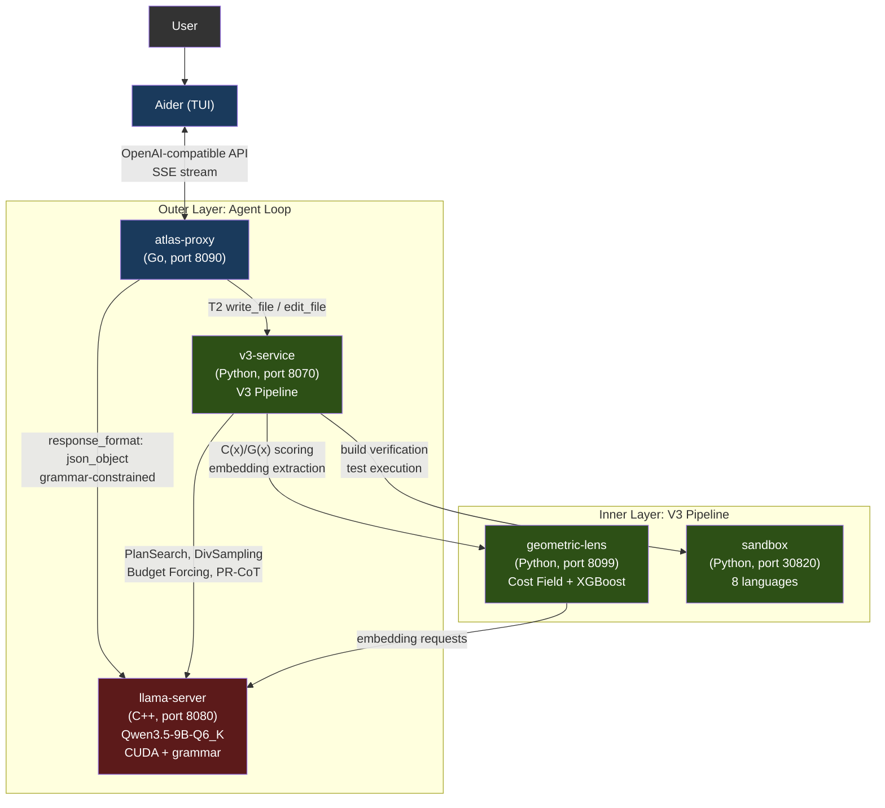

Services run as containers via Docker Compose (recommended) or as local processes via the `atlas` launcher. Only llama-server uses the GPU. Everything else runs on CPU.

---

## 2. Services

| Service | Port | Language | Purpose |
|---------|------|----------|---------|
| **llama-server** | 8080 | C++ (llama.cpp) | LLM inference with CUDA, grammar-constrained JSON, self-embeddings |
| **atlas-proxy** | 8090 | Go | Agent loop, tool-call routing, tier classification, Aider format translation |
| **v3-service** | 8070 | Python | V3 pipeline HTTP wrapper (PlanSearch, DivSampling, PR-CoT, etc.) |
| **geometric-lens** | 8099 | Python (FastAPI) | C(x) energy scoring, G(x) XGBoost quality prediction, RAG/project indexing |
| **sandbox** | 30820 (host) / 8020 (container) | Python (FastAPI) | Isolated code execution, compilation, linting, test running |

---

## 3. atlas-proxy (Outer Layer)

The proxy receives chat completion requests from Aider and runs an internal agent loop.

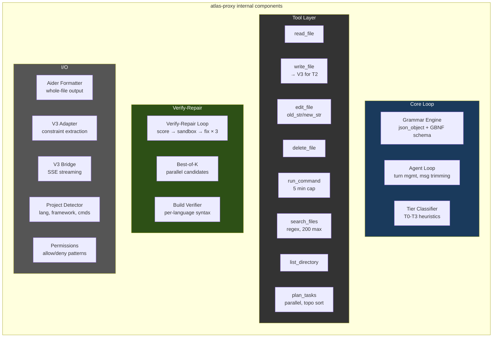

### Agent Loop Flow

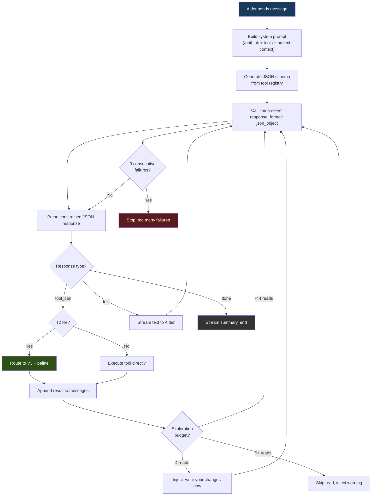

### Grammar Enforcement

llama-server's `response_format: {"type": "json_object"}` forces every model output to be exactly one of three valid JSON shapes:

```json
{"type": "tool_call", "name": "<tool_name>", "args": {...}}
{"type": "text", "content": "<message>"}
{"type": "done", "summary": "<summary>"}
```

The JSON schema uses `oneOf` with `additionalProperties: false` and enumerates tool names from the registry. The model cannot produce invalid JSON — token generation is grammar-constrained at the llama-server level.

### Tools

8 tools available to the model:

| Tool | Purpose | Read-only |
|------|---------|-----------|
| `read_file` | Read file contents (with optional offset/limit) | Yes |
| `write_file` | Create new file or overwrite (routes to V3 for T2 files) | No |
| `edit_file` | Replace exact string in file (old_str/new_str) | No |
| `delete_file` | Delete file or empty directory (forces loop exit after) | No |
| `run_command` | Execute shell command (5 min timeout cap) | No |
| `search_files` | Regex search across files (max 200 matches, skips .git/node_modules) | Yes |
| `list_directory` | List directory contents with type and size | Yes |
| `plan_tasks` | Decompose work into parallel tasks with dependencies | No |

### Per-File Tier Classification

Each `write_file`/`edit_file` call is classified independently:

| Tier | Max Turns | Action |
|------|-----------|--------|
| T0 (Conversational) | 5 | Text response only |
| T1 (Simple) | 30 | Direct write — no V3 overhead |
| T2 (Feature) | 30 | V3 pipeline fires |
| T3 (Hard) | 60 | V3 pipeline fires |

**Always T1 (direct write):**
- Config files by name: package.json, tsconfig.json, Dockerfile, Makefile, pyproject.toml, requirements.txt, .gitignore, and ~30 more
- Data files by extension: .json, .yaml, .yml, .toml, .csv, .xml, .env
- Style files: .css, .scss, .less
- Documentation: .md, .txt, .rst
- Shell scripts: .sh, .bash
- Short files: under 50 lines (V3 overhead exceeds quality gain)

**T2 (V3 pipeline):** Files with 50+ lines AND 3+ logic indicators. Logic indicators include function definitions (`def`, `func`, `function`, `async`), control flow (`if`, `else`, `switch`, `for`, `while`, `try`), API patterns (`export default`, `app.get`, `router.`, `NextResponse`), state management (`useState`, `useEffect`, `dispatch`), and JSX patterns (`return (`, `className=`, `.map(`).

### Safety Limits

| Limit | Value | Purpose |
|-------|-------|---------|
| Conversation trim | Keep 12 messages max (system + first user + last 8) | Prevent context overflow |
| write_file for existing files | Reject if file > 100 lines | Forces edit_file for targeted changes |
| Truncation detection | JSON parse check on tool args | Catches truncated model output |
| Error loop breaker | 3 consecutive failures | Stops runaway failure cycles |
| Exploration budget warning | 4 consecutive read-only calls | Inject "write your changes now" |
| Exploration budget skip | 5+ consecutive read-only calls | Skip the read, return warning |
| Command stdout | 8,000 chars max | Prevent context flooding |
| Command stderr | 4,000 chars max | Prevent context flooding |
| Search results | 200 matches max | Prevent context flooding |
| File search | Skip files > 1 MB | Performance |

---

## 4. V3 Pipeline (Inner Layer)

Activates inside `write_file`/`edit_file` executors for T2+ files. The pipeline has four phases with early exits at every stage.

### Pipeline Flow

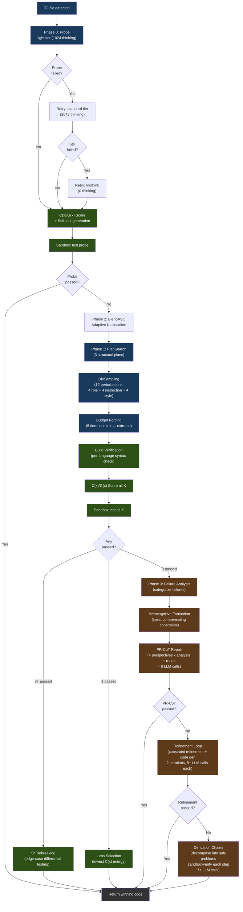

Legend: blue = generation, green = verification/selection, brown = repair.

### Phase Details

**Phase 0: Probe** generates a single baseline candidate with progressive retry (light → standard → /nothink). Scored with C(x)/G(x) and tested in sandbox. If it passes, pipeline exits immediately.

**Phase 1: Constraint-Driven Generation**

- **PlanSearch** generates 3 structurally different implementation plans by extracting distinct constraint sets
- **DivSampling** applies perturbation diversity: 4 roles (competitive_programmer, systems_engineer, mathematician, pragmatist) + 4 instructions (step_by_step, edge_case_first, complexity_aware, constraint_driven) + 4 styles (functional, pythonic, optimize_iteratively, structured)
- **Budget Forcing** controls thinking token allocation:

| Tier | Thinking Tokens | Wait Injection |
|------|----------------|----------------|
| nothink | 0 | /nothink prompt |
| light | 1,024 | None |
| standard | 2,048 | If thinking ends < 512 tokens |
| hard | 4,096 | If thinking ends < 1,024 tokens |
| extreme | 8,192 | If thinking ends < 2,048 tokens |

Wait injection appends "Wait, let me reconsider.\n" to force longer thinking. Tier selection driven by C(x) energy.

**Phase 2: Verification and Selection**

- **Build Verification**: Python (`py_compile`), TypeScript (`tsc --noEmit`), JavaScript (`node --check`), Go (`go build`), Rust (`cargo check`), C/C++ (`gcc/g++ -fsyntax-only`), Shell (`bash -n`). Framework overrides for Next.js, React, Flask, Django, Express.
- **S* Tiebreaking** (2+ passing): generates edge-case inputs, runs both candidates, majority wins
- **Lens Selection** (1 passing or fallback): sort by C(x) energy, lowest wins

**Phase 3: Repair** (if 0/K pass) — three strategies, sequential with early exit:

- **Failure Analysis**: categorize failures (wrong_algorithm, implementation_bug, edge_case_miss, time_limit, format_error, partial_correct)
- **Metacognitive Evaluation**: inject compensating constraints from known Qwen3.5 failure patterns
- **PR-CoT**: 4 perspectives (logical_consistency, information_completeness, biases, alternative_solutions) x (analysis + repair) = ~8 LLM calls, up to 3 rounds
- **Refinement Loop**: Failure Analysis → Constraint Refinement → Code Gen → Test → Learn. 2 iterations, 120s budget, ~5+ LLM calls each. Cosine distance filtering (>= 0.15) prevents hypothesis repetition
- **Derivation Chains**: decompose into up to 5 sub-problems, sandbox-verify each, compose final. ~7+ LLM calls

### Module Map

19 Python modules in `benchmark/v3/` orchestrated by `v3-service/main.py`:

```mermaid
graph TD
    Main["v3-service/main.py\nHTTP wrapper + pipeline orchestrator"]

    Main --> PS["plan_search.py\nPlanSearch (1A)\n3 plans, 3-step pipeline"]
    Main --> DS["div_sampling.py\nDivSampling (1B)\n12 perturbations"]
    Main --> BF["budget_forcing.py\nBudgetForcing (1C)\n5 tiers, Wait injection"]
    Main --> BASC["blend_asc.py\nBlendASC (2A)\nadaptive K from energy"]
    Main --> REASC["reasc.py\nReASC (2B)\nearly stopping"]
    Main --> SSTAR["s_star.py\nS* (2C)\ndifferential tiebreaking"]
    Main --> CS["candidate_selection.py\n4 strategies:\nlens, random, logprob, oracle"]
    Main --> FA["failure_analysis.py\nFailureAnalyzer (3A)\n6 failure categories"]
    Main --> CR["constraint_refinement.py\nConstraintRefiner (3B)\ncosine distance filtering"]
    Main --> PRCOT["pr_cot.py\nPR-CoT (3C)\n4 perspectives"]
    Main --> DC["derivation_chains.py\nDerivationChains (3D)\nsub-problem decomposition"]
    Main --> RL["refinement_loop.py\nRefinementLoop (3E)\norchestrator"]
    Main --> MC["metacognitive.py\nMetacognitiveProfile (3F)\nfailure pattern library"]
    Main --> ACE["ace_pipeline.py\nACE (3G)\nplaybook learning"]
    Main --> STG["self_test_gen.py\nSelfTestGen\nmodel-generated tests"]
    Main --> LF["lens_feedback.py\nLensFeedbackCollector\nonline recalibration"]
    Main --> ES["embedding_store.py\nEmbeddingWriter/Reader\nbinary persistence"]

    RL --> FA
    RL --> CR
    RL --> DC
    BASC --> BF
    REASC --> BF
    LF --> BASC
    LF --> BF
    CR -.->|"cosine distance"| FA

    style Main fill:#333,color:#fff
    style PS fill:#1a3a5c,color:#fff
    style DS fill:#1a3a5c,color:#fff
    style BF fill:#1a3a5c,color:#fff
    style BASC fill:#2d5016,color:#fff
    style REASC fill:#2d5016,color:#fff
    style SSTAR fill:#2d5016,color:#fff
    style CS fill:#2d5016,color:#fff
    style FA fill:#5c3a1a,color:#fff
    style CR fill:#5c3a1a,color:#fff
    style PRCOT fill:#5c3a1a,color:#fff
    style DC fill:#5c3a1a,color:#fff
    style RL fill:#5c3a1a,color:#fff
    style MC fill:#5c3a1a,color:#fff
    style ACE fill:#5c3a1a,color:#fff
    style STG fill:#333,color:#fff
    style LF fill:#333,color:#fff
    style ES fill:#333,color:#fff
```

Legend: blue = Phase 1 (generation), green = Phase 2 (selection), brown = Phase 3 (repair), gray = utilities.

---

## 5. Geometric Lens

Neural scoring system that evaluates code quality without executing it. Runs entirely on CPU. Also serves as the RAG API for project indexing, retrieval, confidence routing, and pattern caching.

### Scoring Models

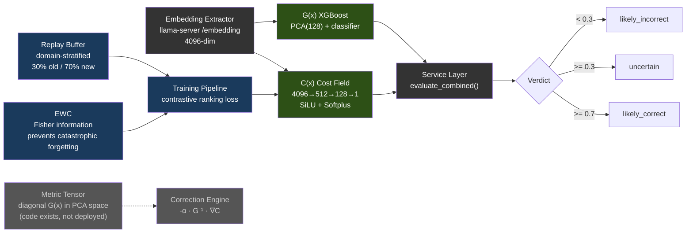

| Model | Architecture | Training Data | Performance |
|-------|-------------|---------------|-------------|
| **C(x)** | 4096→512→128→1 MLP (SiLU, Softplus) | 597 LCB embeddings (504 PASS, 93 FAIL) | Val AUC 0.9467, sep 2.04x |
| **G(x)** | PCA(4096→128) + XGBoost | 13,398 embeddings (4,835 PASS, 8,563 FAIL) | PCA 80.8% variance |

C(x) normalization: `1 / (1 + exp(-(energy - 19.0) / 2.0))` → [0, 1]. Parameters: 2,163,457 (~8.7 MB).

> **Note:** Model weights (.pt, .pkl files) are not committed to the repository — they are built during training and baked into the container image or mounted at runtime. When model files are absent, the service degrades gracefully: C(x) returns neutral energy, G(x) returns `gx_score: 0.5` and `verdict: "unavailable"`. Training data and weights are available on [HuggingFace](https://huggingface.co/datasets/itigges22/ATLAS).

### RAG / PageIndex V2

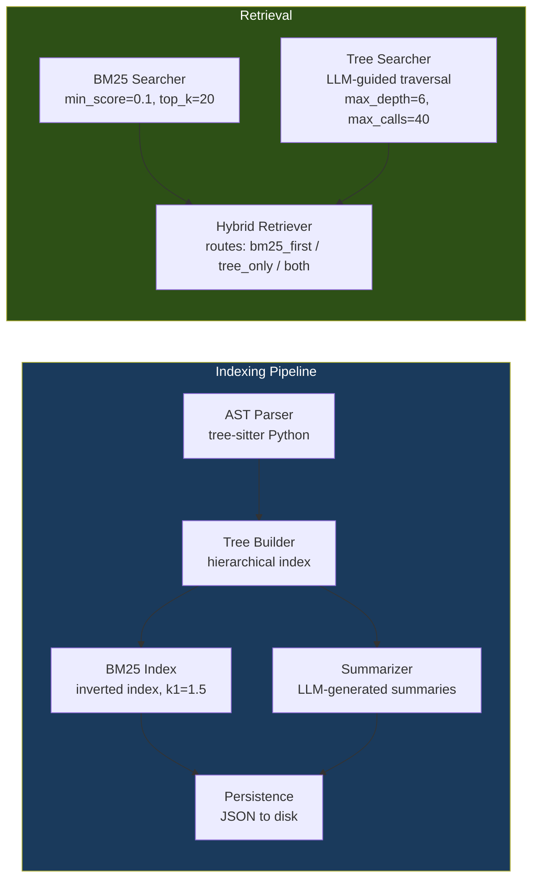

### Confidence Router & Pattern Cache

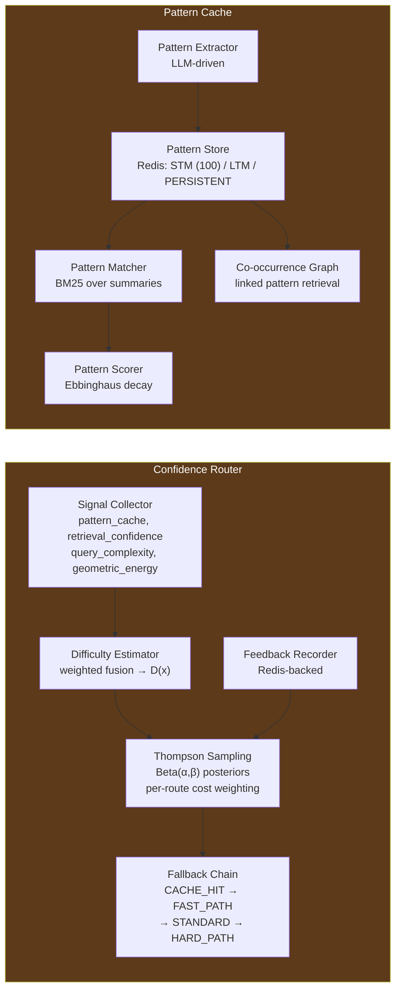

4 routes with cost-weighted Thompson Sampling: CACHE_HIT (cost=1, k=0) → FAST_PATH (cost=50, k=1) → STANDARD (cost=300, k=5) → HARD_PATH (cost=1500, k=20).

---

## 6. Sandbox

Isolated code execution with compilation, testing, and linting.

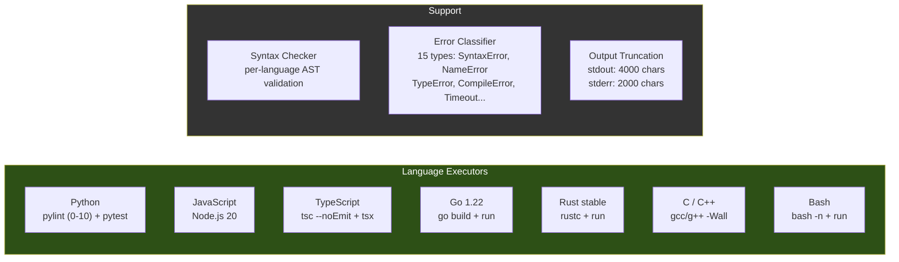

Language aliases accepted: `py`/`python3` (Python), `js`/`node` (JavaScript), `ts` (TypeScript), `golang` (Go), `rs` (Rust), `c++` (C++), `sh`/`shell` (Bash). Max execution time: 60s. Max memory: 512 MB. Workspace: `/tmp/sandbox` (tmpfs).

---

## 7. VRAM Budget

Running on RTX 5060 Ti 16GB with Docker Compose defaults (32K context):

| Component | VRAM |
|-----------|------|
| Qwen3.5-9B-Q6_K model weights | ~6.9 GB |
| KV cache (32K context) | ~1.3 GB |
| **Total llama-server** | **~8.2 GB** |
| Geometric Lens | 0 (CPU-only, ~12 MB RAM for models, ~128 MB for PyTorch runtime) |
| v3-service | 0 (CPU-only) |
| sandbox | 0 (CPU-only) |
| atlas-proxy | 0 (Go binary, ~30 MB RAM) |
| **Free VRAM** | **~7.8 GB** |

All computation outside of llama-server runs on CPU. The GPU is used exclusively for LLM inference and embedding extraction.

---

## 8. Deployment

### Docker Compose (Recommended)

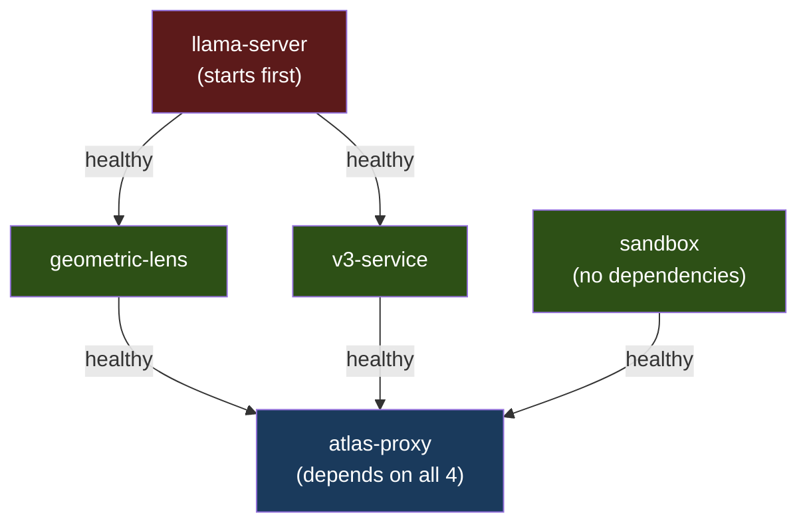

`llama-server` and `sandbox` start independently (no dependencies). `geometric-lens` and `v3-service` wait for `llama-server` to be healthy. `atlas-proxy` waits for all four services. First run builds container images (several minutes); subsequent starts are fast.

### Bare Metal

The `atlas` CLI (`pip install -e .`) talks directly to services on their default ports. The bash launcher script can start all services as local processes and launch Aider, or detect a running Docker Compose stack and connect to it.

### K3s

Manifests in `k8s/templates/` are processed by `scripts/generate-manifests.sh` from `atlas.conf`. Services deploy as pods in the `atlas` namespace with NodePort exposure. K3s deployment uses the entrypoint scripts in `inference/` which support extended context (160K), KV cache quantization (q8_0/q4_0), flash attention, and mlock.

---

## 9. Data Flow

### T1: Simple File Write

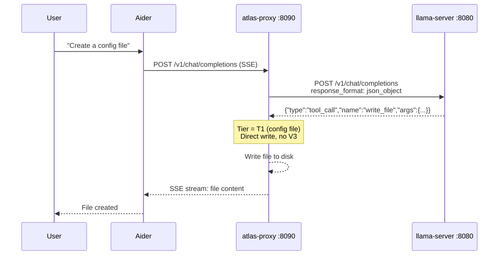

One LLM call. No V3 overhead.

### T2: Feature File Write

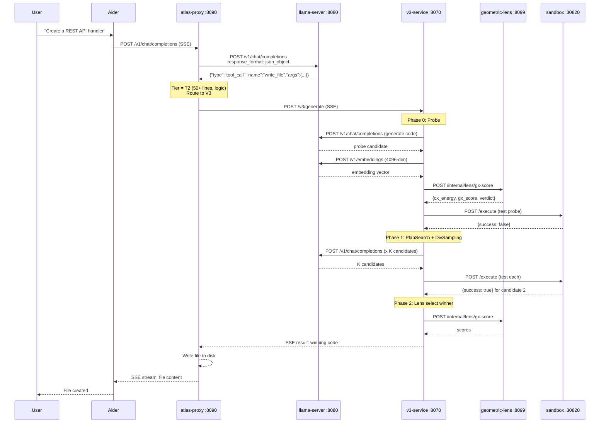

Minimum 3 llama-server calls (1 probe generation + 1 self-test generation + 1 embedding extraction). Maximum 30+ if Phase 3 repair engages all strategies.

### Edit Existing Code

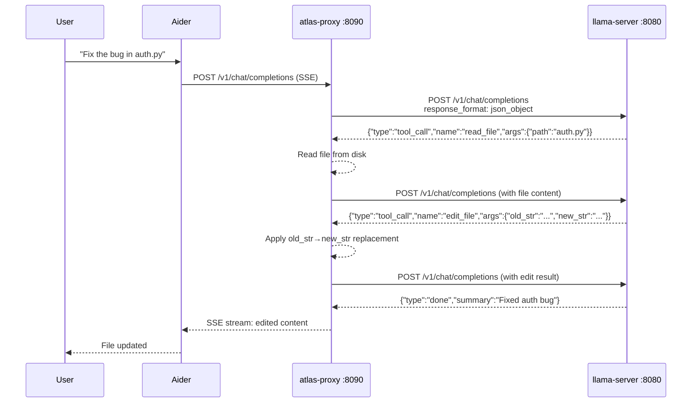

Existing files over 100 lines are rejected for `write_file` — the model must use `edit_file` with targeted changes.
